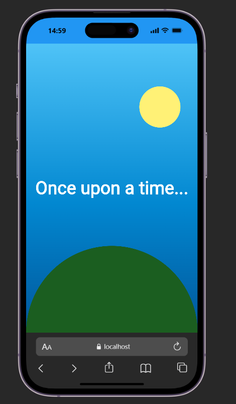

# CutomPaint-Widget

A simple Flutter example that uses the CustomPaint widget to draw a colorful sky scene with a sun and a landscape behind centered text.

## Run the app

1. Open the project folder:
   ```bash
   cd custompaint
   ```
2. Install dependencies:
   ```bash
   flutter pub get
   ```
3. Start the app:
   ```bash
   flutter run
   ```

## CustomPaint attributes

This sample uses the three main attributes of CustomPaint:

- `painter`: draws the background artwork.
- `foregroundPainter`: draws additional content on top of the child widget.
- `child`: displays the regular Flutter UI above or below the painted layer.

In this example, the painter creates the sky and landscape, while the child shows the text overlay.

